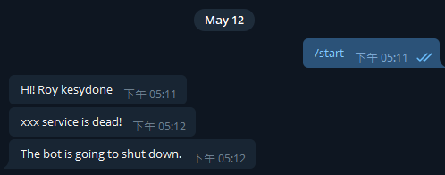

# Introduction
A simple telegram bot with flask.<br/>

Use AES/CFB encrypt message.<br/>



# How To Create Your Own Bot
If you know how to use docker, it is recommended that use 
```
docker-compose up
```
on the premise that you have filled in the config.yml

1. Apply to "BotFather" for your bot token

1. write config.yml
    - bot token

    - add your username to whitelist

    - AES key
        - You can use "generate_key.py" to generate your own key


2. ```bat
    pipenv install
    ```

3. ```bat
    pipenv run python main.py
    ```

# API
- `POST` /send

    - Parameters

        name | info
        -- | --
        iv | AES initial vector
        encrypted_message | encrypted < message and timestamp >


# Note 
- If API needs iv and encrypted_message

    you can use
    ```python
    from utils.SecurityGuard import SecurityGuard
    
    security_guard = SecurityGuard()
    iv, encypt_message = security_guard.encrypt_message(<msg>, <key>)
    ```
    to get these parameters
